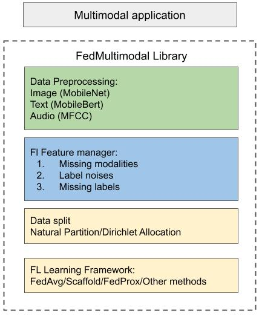

# FedMultimodal
#### FedMutimodal is an open source project for researchers exploring multimodal applications in Federated Learning setup

The framework figure:

 

## Applications supported
* Speech Emotion Recognition
* Multimedia Action Recognition
* Human Activity Recognition

### Speech Emotion Recognition (Natural Split)

Dataset | Modality | Paper | Num. of Train Speakers | Hours of data | Best UAR (Federated) | Learning Rate | Global Epoch
|:---:|:---:|:---:|:---:|:---:|:---:|:---:|:---:|
MELD | A+T+V | [arxiv](https://arxiv.org/abs/1810.02508) | 86 |     | 55.02% | 0.01 | 300
MSP-Podcast | A+T(ASR) | [TAFFC'19](https://ecs.utdallas.edu/research/researchlabs/msp-lab/publications/Lotfian_2019_3.pdf) | >200 |    |

### Multimedia Action Recognition (Manual Split)

Dataset | Modality | Paper | Num. of Clients | Alpha | Best Top-1 Acc (Federated) | Best Top-5 Acc (Federated) | Learning Rate | Global Epoch
|:---:|:---:|:---:|:---:|:---:|:---:|:---:|:---:|:---:|
UCF101   | A+V   | [arxiv](https://arxiv.org/abs/1212.0402)   | 100   | 1.0   0.5   0.1 | 70.20%   69.26%   66.63% | 93.66%   93.56%   92.13% | 0.05   | 300   
MIT | A+V | [arxiv](https://arxiv.org/abs/1801.03150) | 1000 |

Feel free to contact us!

Tiantian Feng, University of Southern California

Email: tiantiaf@usc.edu